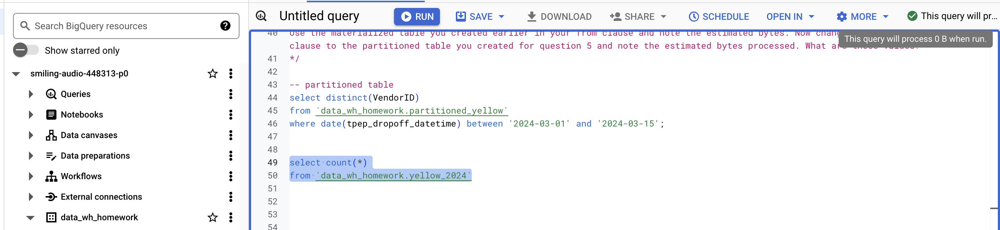

## Module 3 Homework

For this homework we will be using the Yellow Taxi Trip Records for January 2024 - June 2024 Parquet Files from the New York City Taxi Data found here:

https://www.nyc.gov/site/tlc/about/tlc-trip-record-data.page

### Manual Download & Upload

1. Created a yellow_taxi_2024 bucket on GCS
2. Downloaded the parquet files from the link above and uploaded them to the bucket


3. Created an external table on BigQuery with the following command:
```sql
CREATE OR REPLACE EXTERNAL TABLE `smiling-audio-448313-p0.data_wh_homework.external_yellow_2024`
OPTIONS(
  FORMAT='PARQUET',
  URIS=['gs://yellow_taxi_2024/*.parquet']
)
```

4. Created a regular table in BigQuery with the following command:
```sql
CREATE OR REPLACE TABLE data_wh_homework.yellow_2024 AS (
SELECT *
FROM `data_wh_homework.external_yellow_2024`
)
```


### Question 1:
What is count of records for the 2024 Yellow Taxi Data?

- 65,623
- 840,402
- 20,332,093
- 85,431,289

```sql
SELECT COUNT(1) FROM data_wh_homework.yellow_2024;
```
Answer: **20,332,093**


### Question 2:
Write a query to count the distinct number of PULocationIDs for the entire dataset on both the tables.
What is the **estimated amount** of data that will be read when this query is executed on the External Table and the Table?

- 18.82 MB for the External Table and 47.60 MB for the Materialized Table
- 0 MB for the External Table and 155.12 MB for the Materialized Table
- 2.14 GB for the External Table and 0MB for the Materialized Table
- 0 MB for the External Table and 0MB for the Materialized Table

Materialized Table:


External Table:


Answer: **0 MB for the External Table and 155.12 MB for the Materialized Table**


### Question 3:
Write a query to retrieve the PULocationID from the table (not the external table) in BigQuery. Now write a query to retrieve the PULocationID and DOLocationID on the same table. Why are the estimated number of Bytes different?

- BigQuery is a columnar database, and it only scans the specific columns requested in the query. Querying two columns (PULocationID, DOLocationID) requires reading more data than querying one column (PULocationID), leading to a higher estimated number of bytes processed.
- BigQuery duplicates data across multiple storage partitions, so selecting two columns instead of one requires scanning the table twice, doubling the estimated bytes processed.
- BigQuery automatically caches the first queried column, so adding a second column increases processing time but does not affect the estimated bytes scanned.
- When selecting multiple columns, BigQuery performs an implicit join operation between them, increasing the estimated bytes processed

First Query:


Second Query:


Answer: **BigQuery is a columnar database, and it only scans the specific columns requested in the query. Querying two columns (PULocationID, DOLocationID) requires reading more data than querying one column (PULocationID), leading to a higher estimated number of bytes processed.**


### Question 4:
How many records have a fare_amount of 0?

- 128,210
- 546,578
- 20,188,016
- 8,333

```sql
select count(fare_amount)
from `data_wh_homework.yellow_2024`
where fare_amount = 0 ;
```
Answer: **8333**


### Question 5:
What is the best strategy to make an optimized table in Big Query if your query will always filter based on tpep_dropoff_datetime and order the results by VendorID (Create a new table with this strategy)

- Partition by tpep_dropoff_datetime and Cluster on VendorID
- Cluster on by tpep_dropoff_datetime and Cluster on VendorID
- Cluster on tpep_dropoff_datetime Partition by VendorID
- Partition by tpep_dropoff_datetime and Partition by VendorID

Answer: **Partition by tpep_dropoff_datetime and Cluster on VendorID**

```text
The best strategy here is to **partition by tpep_dropoff_datetime and cluster by VendorID,** and here’s why.

Imagine you have a massive filing cabinet filled with taxi trip records. Each drawer represents a partition, and each folder inside a drawer represents a cluster.

Since your queries will always filter by tpep_dropoff_datetime, it makes sense to partition by it—this way, when you're looking for trips from a specific date, you only need to open that drawer instead of searching through the entire cabinet. That saves a ton of time and effort!

Now, within each drawer, clustering by VendorID is like organizing the files alphabetically by vendor. So, when you need all trips from a specific vendor, you don’t have to shuffle through a mess—it’s already grouped neatly.
```

### Question 6:
Write a query to retrieve the distinct VendorIDs between tpep_dropoff_datetime 2024-03-01 and 2024-03-15 (inclusive)

Use the materialized table you created earlier in your from clause and note the estimated bytes. Now change the table in the from clause to the partitioned table you created for question 5 and note the estimated bytes processed. What are these values?

Choose the answer which most closely matches.

- 12.47 MB for non-partitioned table and 326.42 MB for the partitioned table
- 310.24 MB for non-partitioned table and 26.84 MB for the partitioned table
- 5.87 MB for non-partitioned table and 0 MB for the partitioned table
- 310.31 MB for non-partitioned table and 285.64 MB for the partitioned table

Answer: **310.24 MB for non-partitioned table and 26.84 MB for the partitioned table**

Materialized Table:


Partitioned Table:


### Question 7:
Where is the data stored in the External Table you created?

- Big Query
- Container Registry
- GCP Bucket
- Big Table

Answer: **GCP Bucket**


### Question 8:
It is best practice in Big Query to always cluster your data:

- True
- False

Answer: **False**

```text
Explanation:
It’s not always necessary to cluster your data in BigQuery. Clustering improves query performance when you frequently filter or order by specific columns, but it comes with additional storage costs and performance overhead during data ingestion. 

It’s best to cluster only when you have clear use cases that benefit from it, such as filtering by certain columns (like VendorID in question 5). For datasets where you don’t need to filter or order by specific columns often, clustering might not provide significant benefits.
```

### (Bonus: Not worth points) Question 9:
No Points: Write a SELECT count(*) query FROM the materialized table you created. How many bytes does it estimate will be read? Why?



Answer: **0B**
```text
Explanation:
The SELECT count(*) query returned 0B bytes read because materialized tables in BigQuery are pre-computed and stored as a physical table. When you run a count() operation, BigQuery only needs to read the metadata that stores this information, rather than scanning the actual data.

This is one of the key benefits of materialized tables - they provide extremely fast access to pre-computed results without needing to process the underlying data again. The metadata contains information like the total row count, making simple operations like COUNT(*) essentially free in terms of bytes processed.
```
